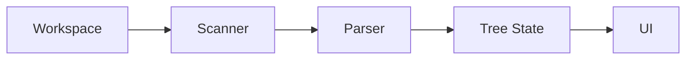

# Core Architecture

## Model: Scan once, navigate often

Deep-parsing every file on every keystroke would be too heavy. Instead, the extension uses **on-demand indexing**: the user triggers a "Generate Map" action (status bar or Command Palette). A background indexing job runs once; the resulting tree is kept in memory and used for navigation and docblock previews until the next scan or session end.

- **Index on demand** — not on every keystroke.
- **Navigate often** — open file, go to line/symbol, show docblocks from the cached tree.

---

## Provider options

Two ways to present the map in VS Code:

| Option | Description |
|--------|-------------|
| **TreeDataProvider** | Native sidebar tree. Fits well with VS Code’s UI and ThemeIcons; more restrictive styling. |
| **Webview Panel** | Dedicated tab with full control over HTML/CSS/JS. Recommended for a modern, custom look. |

**Recommendation:** Use the **Webview API** for a separate tab so the tree can have custom styling and interaction while still integrating with the editor (e.g. opening files and revealing symbols).

---

## Parser

For PHP (and similar needs for other languages):

- Use a **JS-based parser** (e.g. `php-parser`) that runs in the extension host.
- Extract **classes**, **methods**, and **docblocks** without executing code.
- Same idea applies to JS (functions, ES6 classes) and, at file level, to CSS/HTML.

Parsing is AST- or regex-based as appropriate; the goal is to build the in-memory tree structure that the UI consumes.

---

## State

- A **JSON-like tree** structure held **in memory** while the IDE is open.
- Represents: folders → files → classes → methods/properties (and optional doc, line).
- **No persistence requirement for Phase 1** — the map is regenerated when the user runs "Generate Map" again or when the workspace is reopened.

---

## Component overview

- **Workspace** — opened folders and files.
- **Scanner** — iterates relevant file types (e.g. `*.php`, `*.js`, `*.html`).
- **Parser** — extracts symbols (classes, methods, docblocks) per file.
- **Tree State** — in-memory structure fed to the UI.
- **UI** — TreeDataProvider or Webview that renders the tree and handles navigation/docblock preview.
