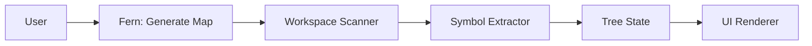

# Data Flow

The logic flows in three main steps from user action to rendered tree.

---

## Step-by-step flow

1. **Workspace Scanner**  
   Iterates through the workspace for relevant file types: `*.php`, `*.js`, `*.html`, etc. (with exclusions such as `vendor` by default). Produces a list of files to parse.

2. **Symbol Extractor**  
   For each file, uses **regex or AST** to find symbols: e.g. `class User`, `function save()`, methods, properties. Extracts docblocks where present. Builds a per-file symbol list with labels, types, and line numbers.

3. **UI Renderer**  
   Maps the extracted symbols to a **recursive Tree View**. Folder/file hierarchy comes from the scanner; class/method hierarchy comes from the extractor. The same tree structure is stored in memory and rendered in the sidebar or Webview.

---

## Flow diagram

- **User** triggers the command (status bar or Command Palette).
- **Workspace Scanner** discovers files (e.g. `*.php`, `*.js`, `*.html`).
- **Symbol Extractor** parses each file and collects classes, methods, docblocks, etc.
- **Tree State** holds the JSON-like tree in memory.
- **UI Renderer** displays the tree and handles navigation and docblock preview.
